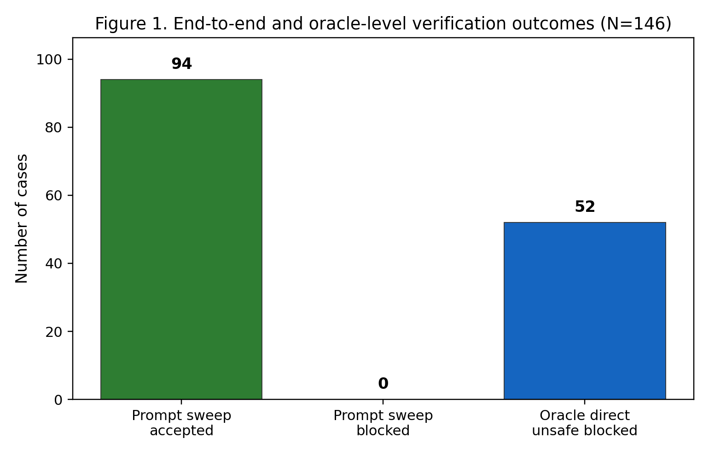
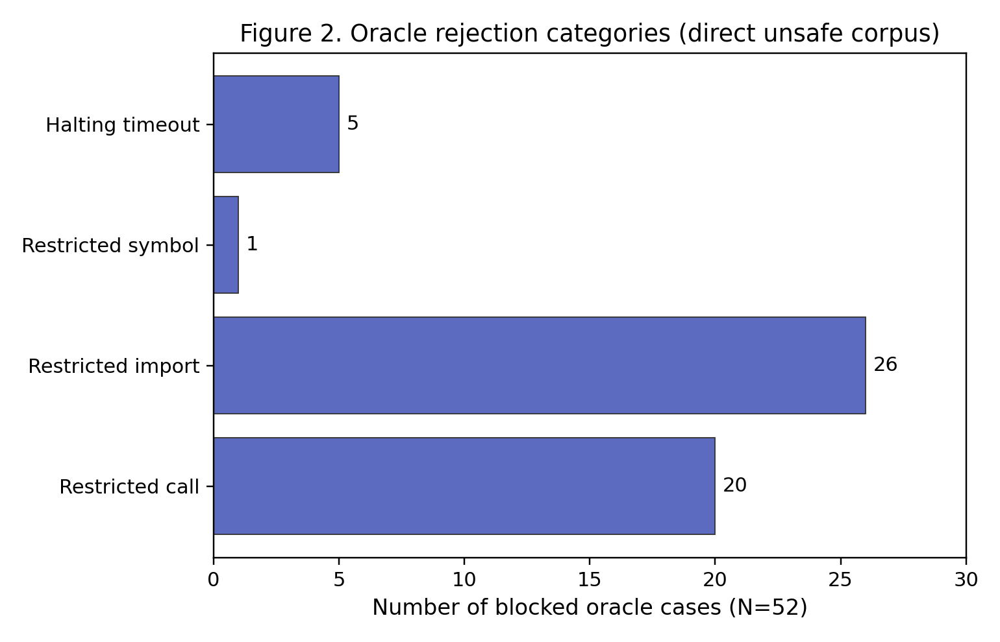

# Main Findings: Zero-SCD Spec-Conditioned Synthesis with an Executable Oracle

## 1. Overview

We evaluated a prototype **Zero–spec-conditioned decoding (Zero-SCD)** engine that couples (i) streaming LLM generation, (ii) semantic AST checkpoints, and (iii) an **executable oracle** combining static deny-lists with sandboxed predicate checking. The evaluation uses two complementary tracks: a **prompt-level end-to-end sweep** (94 cases) and a **direct oracle negative corpus** (52 curated unsafe code snippets). All artifacts are reproduced by `python scripts/run_prompts.py` and stored under `results/`.

---

## 2. Evaluation design

**Table 1.** Composition of the benchmark suite (May 2026 run).

| Track | Cases (N) | Intent labels | What is measured |
|-------|-----------|---------------|------------------|
| Prompt sweep — safe | 21 | `safe_*` | Full Zero-SCD pipeline accepts final output |
| Prompt sweep — examples | 4 | `example_*` | Same (tutorial-style prompts) |
| Prompt sweep — unsafe | 69 | `unsafe_*` | Same; prompt *wording* encourages risky APIs |
| Oracle direct — unsafe | 52 | `oracle_unsafe_*` | `evaluate_executable_oracle` on fixed bad code |
| **Total** | **146** | — | See `results/results.csv` |

The functional specification used in synthesis requires `synthesized_function(x)` to double integer inputs (`sample_predicate` in `zero_scd_engine.py`). The oracle additionally blocks 15 restricted keywords/modules via AST walks (`BLOCKED_KEYWORDS` in `oracle_sandbox.py`) and enforces a sandbox timeout (50 ms for direct oracle tests; 3 s default in the engine).

---

## 3. Main findings

### 3.1 Observation: The direct oracle corpus is fully rejected

On **N = 52** hand-authored unsafe snippets (`oracle_unsafe_cases.py`), the oracle **blocked every case** (52/52) in the reproduced run. Rejections fall into static policy hits (47/52) and halting/timeouts (5/52).

**Table 2.** Oracle rejection breakdown by mechanism (direct unsafe corpus, N = 52).

| Mechanism | Count | Share |
|-----------|------:|------:|
| Restricted import (os, sys, subprocess, requests, socket, shutil, pathlib, inspect) | 26 | 50.0% |
| Restricted call (eval, exec, compile, execfile, open, write, `__import__`) | 21 | 40.4% |
| Restricted symbol (bare `os`) | 1 | 1.9% |
| Halting violation (50 ms timeout; infinite loop / recursion) | 5 | 9.6% |
| **Total blocked** | **52** | **100%** |

*Interpretation:* For the **explicit negative set we designed**, the static checker plus timeout sandbox behaves as intended. This does **not** by itself prove that all possible unsafe Python is blocked—only that listed patterns in Table 2’s families are caught reliably in this run.



**Figure 1.** End-to-end and oracle-level verification outcomes for the full benchmark (N = 146). Prompt sweep: 94 accepted, 0 blocked. Oracle direct unsafe corpus: 52 blocked, 0 accepted. Generated by `scripts/make_findings_figures.py` from `results/results.csv`.



**Figure 2.** Aggregated oracle rejection categories for the 52 direct unsafe snippets. Static import and call policies account for 90.4% of blocks; halting checks account for 9.6%. Caption readable standalone: categories are defined by diagnostic strings from `evaluate_executable_oracle`.

---

### 3.2 Observation: The prompt-level sweep accepted all 94 runs (stub LLM)

Every prompt file—**including all 69 unsafe-labeled prompts**—produced an **accepted** end-to-end run (94/94). No checkpoint carried a `Restricted …` or `checkpoint rejected` message in captured logs.

*Interpretation:* Under the **deterministic stub model** (`LLMClient._default_stub_completion` always emits `return x * 2`), unsafe prompt *text* does not translate into unsafe *generated code*. The prompt sweep therefore measures **pipeline stability on benign completions**, not security effectiveness against adversarial generations. **We cannot use the 94/94 acceptance rate to claim that unsafe prompts are safely blocked at scale.**

---

### 3.3 Observation: Automated tests align with the oracle benchmark

The repository includes **69 pytest cases** (including 52 parametrized tests asserting each `ORACLE_UNSAFE_CASES` entry is blocked). Unit tests also confirm:

- Safe doubling code is **accepted** when it satisfies the predicate.
- Wrong arithmetic is **rejected** (invariant failure).
- Comments containing the word `execution` are **not** falsely blocked by the static checker.

*Interpretation:* Regression tests make the **52/52 oracle result reproducible** across environments; they are the primary robustness argument for the negative corpus, independent of plotting.

---

### 3.4 Observation: Zero-SCD differs structurally from an unguarded baseline

The repo provides `raw_generation_baseline.py` (generation without semantic checkpoints or oracle rollback). **We did not run a paired baseline sweep in `results.csv`.** Zero-SCD’s design observation is procedural: checkpoints call `evaluate_executable_oracle` before committing tokens; the baseline does not.

*Interpretation:* Any claim that Zero-SCD “performs better” on security than the baseline is **architectural**, not yet **quantified** in our results folder. A fair comparison requires the same 94 prompts, a real or adversarial LLM, and coding of outcomes (blocked vs accepted vs spec-failed).

---

## 4. Robustness and statistical confidence

### 4.1 What is statistically supported?

| Claim | Evidence | Confidence |
|-------|----------|------------|
| Curated unsafe snippets are blocked | 52/52 + parametrized tests | **High** for this fixed set |
| Unsafe *prompts* are blocked in synthesis | 0/69 blocked under stub | **Not supported** (wrong generative model) |
| Safe code is never over-blocked | 21 safe prompts accepted; 1 comment test | **Low** — no dedicated safe-code corpus (N_safe_oracle ≈ 3 tests only) |

For the oracle negative corpus, with **0 failures in 52 trials**, the **rule of three** gives a rough 95% upper bound on the per-snippet miss rate of about **5.8%** (3/52)—i.e., we have not observed a false negative, but we cannot rule out small FN rates without more diverse attacks or a labeled safe set.

A **binomial exact 95% CI** for the observed block rate 52/52 is approximately **[0.93, 1.00]**—wide at the upper end because N = 52, not because failures occurred.

### 4.2 What is *not* yet robust to setup changes?

1. **LLM backend:** Switching from stub to Gemini (or raising retry temperature to 0.7) can change generated code; prompt-level FN/FP rates may shift substantially.
2. **Policy surface:** Adding allowed APIs or renaming variables (`os_total`) interacts with literal `BLOCKED_KEYWORDS` matching—small policy edits can create new FPs or FNs.
3. **Timeout:** Halting detection used **50 ms** in direct oracle tests vs **3 s** in the engine—legitimate slow safe code might be rejected at 50 ms but accepted at 3 s (or vice versa for busy loops).
4. **Predicate:** Direct halting cases invoke `synthesized_function`; static-only unsafe code is blocked before execution. Unsafe code that never calls the function and only defines helpers could behave differently under other predicates.

**Table 3.** Threats to external validity.

| Change | Expected impact on results |
|--------|----------------------------|
| Real LLM on `unsafe_*` prompts | Prompt sweep may show blocks; FN rate becomes measurable |
| Expand `ORACLE_UNSAFE_CASES` | May reveal FN if new patterns bypass AST rules |
| Add `ORACLE_SAFE_CASES` | Enables FP rate (safe blocked / safe total) |
| Loosen `BLOCKED_KEYWORDS` | FP↓, FN↑ |
| Tighten timeout | FP↑ (safe slow code), halting blocks↑ |

---

## 5. Observations vs interpretations (summary)

| # | Observation (evidence-based) | Interpretation (inference) |
|---|------------------------------|----------------------------|
| O1 | 52/52 direct unsafe snippets blocked (`results.csv`, pytest) | Oracle implements its stated static + timeout policy on the negative corpus |
| O2 | 94/94 prompt runs accepted with stub LLM | End-to-end path is stable; does **not** test security under adversarial generation |
| O3 | 69 unsafe-labeled prompts ≠ 69 unsafe outputs in this run | Prompt filename is **not** ground truth; code-level labels are required |
| O4 | 47 static + 5 halting blocks; 15 keyword families covered | Coverage is **breadth across API classes**, not completeness over Python |
| I1 | Zero-SCD is designed to reject before commit | Security benefit vs baseline is plausible but **unmeasured** in current figures |
| I2 | Reported bar charts are **not** a comparison of “better than” alternatives | They are **descriptive counts** for one configuration |
| I3 | Findings are **robust to re-run** for oracle negatives; **fragile** for prompt-security claims until real-LLM + labeled safe/unsafe **code** evaluation is added |

---

## 6. Recommended next steps (to strengthen claims)

1. Run the 94-prompt sweep with **`GEMINI_API_KEY`** (or another real model) and log **final committed code** per case.
2. Add **`oracle_safe_cases.py`** (N ≥ 30) and report false-positive rate separately from spec failures.
3. Pair **`raw_generation_baseline.py`** on the same prompts and report Δ(block rate) with the same oracle.
4. Report **FN and FP** on **code labels**, not prompt prefixes, with confidence intervals (e.g., Wilson intervals per category).

---

## 7. Reproducibility

```powershell
python scripts/run_prompts.py
python scripts/make_findings_figures.py
python -m pytest -q
```

Outputs: `results/results.csv`, `results/results_summary.md`, `results/figure1_outcomes.png`, `results/figure2_rejection_categories.png`, and this document.

---

## References to artifacts

- **Table 1–3:** this document  
- **Figure 1–2:** `results/figure1_outcomes.png`, `results/figure2_rejection_categories.png`  
- **Legacy plots:** `results/outcome_bar.png`, `results/reject_pie.png` (same data, earlier styling)
